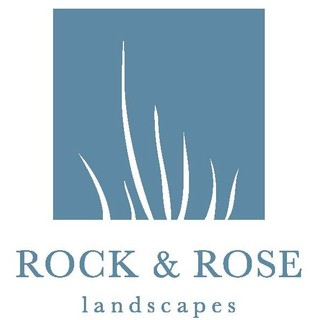
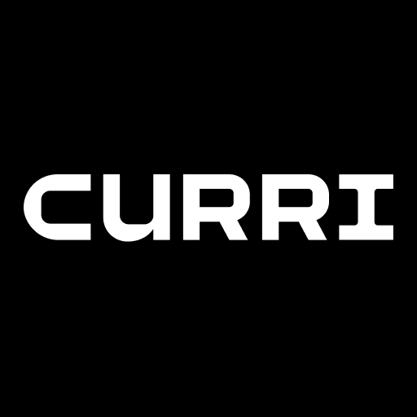
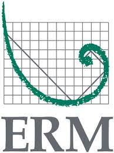

  

#
# We have a wide range of technical and consulting.
# Click to find out more about each company.
#

  
****

<left>
## Rock and Rose Landscapes

#### **Financial Consultant** *May 2022 - Present*

###### -  **San Francisco, CA**

* Company generates 10+ million in revenue annually
* Help to understand data through visualizations and predictive models
* Communicate data effectively from front office to grounds crew
* Increase efficiency leading to profit gains

[Learn More](https://www.rockandrose.com/home.html)

</left>
****
## Curri

#### **Data Engineer** *specify date - Present*

###### -  **Ventura, CA**

* what u do
* do u what
* do you you
* you you you

[Learn More](https://www.curri.com)

</left>

****

## Malibu Triathlon

#### **Marketing and Activations Manager** *specify date - Present*

* what u do
* do u what
* do you you
* you you you

[Learn More](https://malibutri.com/?gclid=EAIaIQobChMI686_gfvH-AIVVBh9Ch3XiAYdEAAYASAAEgKGUPD_BwE)

****

## ERM

#### **Data Scientist** *January 2020 - Present*

* what u do
* do u what
* do you you
* you you you

[Learn More](https://www.erm.com/service/capabilities/data-analytics-visualization/)

